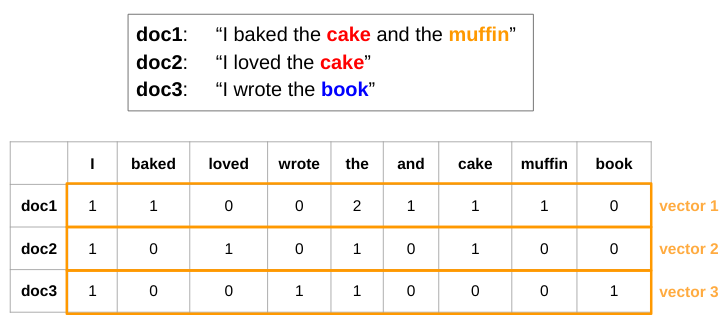
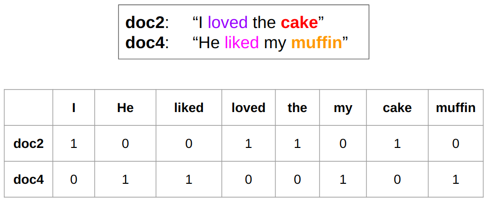
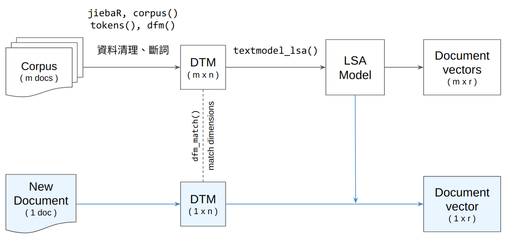

文本與詞彙的向量表徵 {#ch09}
============================

[([投影片](https://docs.google.com/presentation/d/1NXWSy1tQV7R1FQY4qvkcBsbQKsB9d54dfrU6Lj07QAE) /
[程式碼](https://rlads2021.github.io/lab/src/11.zip) /
[影片](https://youtu.be/UViBpa82nks))
]{.course-resource}


Representing Documents
-----------------------

由於資料科學以及統計學方法上的限制，要對文本進行量化分析之前，常常需要將原本以符碼 (文字) 去表徵的文本轉換成數值的表徵，如此我們才有辦法對文本去進行一些資料科學中常見的分析，例如相似度計算、分群、分類等。


### Document-Term Matrix: A Toy Example

將文本轉換成數值的表徵方式相當多，其中一種最簡單的方式，即是使用 document-term matrix 將文本以數值向量去表徵。document-term matrix 裡面記錄著各個文本中的各種詞彙出現的次數。以這 3 篇文本為例：

- `doc1`: *I baked the cake and the muffin*
- `doc2`: *I loved the cake*
- `doc3`: *I wrote the book*

我們可以使用下方的矩陣 `dtm` 去表示這 3 篇文本。在這個矩陣中，每個 row 即是一篇文本的向量表徵 (由上至下依序為 `doc1`, `doc2`, `doc3`)；每個 column 是某個特定的詞彙；矩陣中的數值則是該種詞彙出現在該篇文本的次數，例如 cell `(2, 1)` 代表 `I` 這個詞彙在 `doc2` 中出現了 1 次。

```{r}
#' doc1:	"I baked the cake and the muffin"
#' doc2:	"I loved the cake"
#' doc3:	"I wrote the book"
#' TERMS:        I  baked loved wrote the and cake muffin book
dtm <- matrix(c( 1,   1,    0,    0,   2,  1,   1,    1,   0 ,
                 1,   0,    1,    0,   1,  0,   1,    0,   0 , 
                 1,   0,    0,    1,   1,  0,   0,    0,   1 ), 
              nrow = 3, ncol = 9, byrow = TRUE)
dtm
```


```{r echo=F}

```

有了文本的向量表徵之後，我們就能去量化比較文本之間的相似度，方法是直接利用向量之間的距離公式 $d(\overrightarrow{p}, \overrightarrow{q})$ 以及相似度公式 $cos(\theta)$：

$$
d(\overrightarrow{p}, \overrightarrow{q}) = \sqrt{ (p_1 - q_1)^2 + (p_2 - q_2)^2 + ... + (p_n - q_n)^2 }
$$

$$
cos(\theta) = \frac{\overrightarrow{p} \cdot \overrightarrow{q}}{\lVert p \rVert \lVert q \rVert }
$$

為了避免每篇文本長度不同造成的文本向量長度不同，在使用距離公式時，我們通常會多一個將向量常規化的動作，讓兩個文本向量的長度變得一樣 (i.e., 皆變成單位向量)

```{r}
#### Distance / Similarity Measures ####
cossim <- function(x1, x2)
  sum(x1 * x2) / sqrt( sum(x1^2) * sum(x2^2) )

eudist <- function(x1, x2) 
  sqrt( sum( (as_unit_vec(x1) - as_unit_vec(x2))^2 ) )

as_unit_vec <- function(x) x / sqrt(sum(x^2))  # Normalize vector length
```

```{r results='hold'}
eudist(dtm[1, ], dtm[2, ])
eudist(dtm[1, ], dtm[3, ])
eudist(dtm[2, ], dtm[3, ])
```

```{r results='hold'}
cossim(dtm[1, ], dtm[2, ])
cossim(dtm[1, ], dtm[3, ])
cossim(dtm[2, ], dtm[3, ])
```


### Creating Document-Term Matrix with quanteda

在上方的例子，我們是自己透過手刻的方式去製作 document-term matrix。`quanteda` 則提供了將 `tokens` object 轉換成 document-term matrix 的函數：

```{r}
library(dplyr)
library(quanteda)
library(quanteda.textstats)
library(quanteda.textmodels)

# Document data frame
docs_df <- readRDS("samesex_marriage.rds")

# Token object
q_tokens <- corpus(docs_df, docid_field = "id", text_field = "content") %>%
  tokenizers::tokenize_regex(pattern = "\u3000") %>%
  tokens()

# Document-term matrix (feature selection)
q_dfm <- dfm(q_tokens) %>% 
  dfm_remove(pattern = readLines("stopwords.txt"), valuetype = "fixed") %>%
  dfm_select(pattern = "[\u4E00-\u9FFF]", valuetype = "regex") %>%
  dfm_trim(min_termfreq = 5) %>%
  dfm_tfidf()
q_dfm
```


### Pairwise Document Similarity by raw Document-Term Matrix

`quanteda.textstats::textstat_simil()` 能夠計算 document-term matrix 內文本間的兩兩相似度。如此我們便可透過回傳的矩陣去取得與某篇文章 (e.g., `anti_1.txt`) 最相似的幾篇文章：

```{r}
doc_sim <- textstat_simil(q_dfm, method = "cosine") %>% as.matrix()
dim(doc_sim)

sort(doc_sim["anti_1.txt", ], decreasing = T)[1:8]
```


#### Clustering Using Pairwise Similarity

`quanteda.textstats::textstat_simil()` 所回傳的相似度矩陣也可作為分群演算法的輸入：

```{r out.width="100%"}
doc_name <- function(name, end = 8) 
  paste0(name, '\n', substr(lookup[name], 1, end))

idx <- c(1:10, 151:160)
lookup <- docs_df$title
names(lookup) <- docs_df$id

doc_sim2 <- doc_sim[idx, idx]
row.names(doc_sim2) <- doc_name(row.names(doc_sim2))
colnames(doc_sim2) <- doc_name(colnames(doc_sim2))

## create hclust
clust <- (1 - doc_sim2) %>% as.dist %>% hclust

## plot dendrogram
plot(clust, main = "20 Selected Posts", cex = 0.7,
     xlab="", sub="")
```


#### Network Plot Using Pairwise Similarity

```{r out.width="100%"}
library(quanteda.textplots)
set.seed(10)
textplot_network(as.dfm(doc_sim2),
                 vertex_labelsize = 2)
```


### Latent Semantic Anlysis (Dimensionality Reduction)

由於 document-term matrix 通常很稀疏 (i.e., 很多值是 0)，使文本向量可能無法抓到某些文本之間的語意關聯。例如，在下圖的例子中，`doc2` 與 `doc4` 雖然語意相近，但此二文本的向量的相似度 (cosine similarity) 為零，因為這兩篇文本並未使用到相同的詞彙。

```{r echo=F}

```

面對這種情形，我們可以將高維的 document-term matrix 透過數學方式轉換成維度比較小的矩陣。在這個過程中，document-term matrix 中一些語意相近的詞彙會被壓縮到某個或是某些維度中，讓這個維度比較小的矩陣反而比較能表徵文本之間的語意關聯。這種方式稱為 Latent Semantic Analysis (LSA)，而用來將矩陣分解降維的數學方法稱為 Singular Value Decomposition (SVD)。

```{r results='hold'}
lsa_model <- quanteda.textmodels::textmodel_lsa(q_dfm, nd = 15)
dim(lsa_model$docs)
```

```{r}
# Document similarity
doc_sim2 <- textstat_simil(as.dfm(lsa_model$docs), method = "cosine")
sort(doc_sim2["anti_1.txt", ], decreasing = T)[1:8]
```


### Converting unseen documents to vectors

現在我們已經知道如何將一個語料庫內的所有文本轉換成向量表徵。現在要處理的是**新的資料**：若今天有一篇新的文本，我們要如何將此篇文本轉換成向量，好讓我們可以去將這篇文本與語料庫中的其它文本進行比較？

```{r echo=F, out.width="100%"}

```

要達成這件事，在將新文本轉換成 document-term matrix 時，需要讓新文本的 document-term matrix 在維度上 (詞彙種類以及其在矩陣中順序) 能夠與語料庫的 document-term matrix 對應起來。這可以透過 `quanteda::dfm_match()` 達成。確保了 document-term matrix 的維度相同之後，接著就可以將這個 document-term matrix 餵到 LSA 模型，讓它為這個 document-term matrix 進行降維，進而得到新文本的向量表徵：

```{r}
#### Converting new texts to vector representation ####

# New document
doc <- readLines("sample_post.txt") %>% 
  paste(collapse = "\n")

# Convert raw text to document term matrix
library(jiebaR)
seg <- worker(user = "user_dict.txt")
new_doc_dtm <- list(segment(doc, seg)) %>%
  tokens() %>%
  dfm() %>%
  dfm_match(features = featnames(q_dfm))

# Dimensionality reduction with LSA
p <- predict(lsa_model, newdata = new_doc_dtm)
doc_vec_lsa <- p$docs_newspace[1, ]
doc_vec_lsa
```

如此，我們便可使用這個新文本的向量去和語料庫中的其它文本進行比較：

```{r results='hold'}
cossim(doc_vec_lsa, lsa_model$docs["pro_18.txt", ])
cossim(doc_vec_lsa, lsa_model$docs["anti_18.txt", ])
```


Using Word Vectors
-------------------

詞彙與文本類似，一樣可以透過數值性的向量去表徵。在近幾年表徵詞彙的詞向量技術進展相當快速，且能抓到一些相當細微的語意。但這些詞向量通常需要透過相對大量的資料訓練，其表現才會相對穩定。通常我們也不必自行蒐集語料訓練這些詞向量，因為網路上已有相當多公開的詞向量資源，可直接下載使用。

下方的例子即是使用預先訓練好的詞向量 (儲存於 `ppmi_embeddings_50dim.txt`)。這份詞向量[^ppmi]是透過中研院平衡語料庫訓練而來的，可以透過 `functions.R` 中的 `read_ppmi()` 以 `matrix` 的格式讀進 R 裡： 

```{r}
source("functions.R")
wv <- read_ppmi("ppmi_embeddings_50dim.txt")
```

讀進來後，就可以透過 `wv["{詞彙}", ]` 去取得詞向量 (length == 50 的 numeric vector)：

```{r}
wv["爸爸", ]
```

並可以套用 cosine similarity 的公式去計算兩個詞彙間的相似度：

```{r results='hold'}
cossim(wv["媽媽", ], wv["爸爸", ])
cossim(wv["老師", ], wv["爸爸", ])
```

[^ppmi]: https://github.com/liao961120/PPMI


### Finding Most Similar Words

由於詞向量的檔案通常非常大 (因為詞彙的種類通常遠比文本的數量多很多)，我們無法透過 `quanteda.textstats::textstat_simil()` 去計算詞彙間的兩兩相似度 (運算時間太長)。因此，若想找出與某個特定詞彙 (e.g., `媽媽`) 語意最相似的詞彙，我們可以透過 base R 的 `apply()` 去將 `媽媽` 的詞向量去跟所有的詞向量算出相似度之後再進行排序：

```{r}
most_simil <- function(word_vec, topn = 10) {
  siml <- apply(wv, 1, function(row) cossim(row, word_vec))
  return(sort(siml, decreasing = T)[1:topn])
}

most_simil(wv["媽媽", ])
```


### Word Analogy

近幾年的詞向量技術令人驚奇的其中一個地方來自它們抓到詞彙語意上類比關係的能力。透過詞向量的運算，我們可以要電腦為我們找出類似這種問題的答案：

> **父親**之於**兒子**相當於**母親**之於？  
> **弟弟**之於**哥哥**相當於**妹妹**之於？

```
父親 : 兒子 == 母親 :  ？
弟弟 : 哥哥 == 妹妹 :  ？
v1  -  v2   =  v3  -  v4
v4  =  v3   -  v1  +  v2
```

```{r}
v1 <- wv["父親", ]
v2 <- wv["兒子", ]
v3 <- wv["母親", ]
v4 <- v3 - v1 + v2
most_simil(v4)

v1 <- wv["弟弟", ]
v2 <- wv["哥哥", ]
v3 <- wv["妹妹", ]
v4 <- v3 - v1 + v2
most_simil(v4)
```
