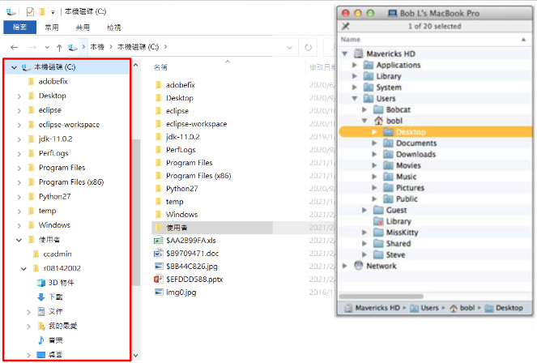

--- 
title: "RLads Lab"
author: "Yongfu Liao"
date: "2021-03-13"
site: bookdown::bookdown_site
output: bookdown::gitbook
documentclass: book
#bibliography: [book.bib, packages.bib]
biblio-style: apalike
link-citations: yes
description: "This is a minimal example of using the bookdown package to write a book. The output format for this example is bookdown::gitbook."
---


```r
knitr::opts_chunk$set(
    echo = TRUE,comment = '#>',message = F,
    out.width = "80%")
library(knitr)
img <- function(...) {
    items = unlist(list(...))
    paths = items
    for (i in seq_along(items)) {
        if (startsWith(items[i], "http://") | startsWith(items[i], "https://")) paths[i] = items[i]
        else 
          paths[i] = paste0("assets/img/", items[i])
    }
    knitr::include_graphics(paths)
}
```

# 關於 {-}

[程式設計與資料科學導論](https://lopentu.github.io/rlads2021)實習課講義

<!--chapter:end:index.Rmd-->

掌握你的電腦 {#lab01}
=====================

[
([投影片](https://docs.google.com/presentation/d/1oghUoCCDI9FWYKEjI9GlwKhevjqIu5FHi5cNWeEtFh0) /
[影片](https://youtu.be/MIuexkT2V4Q))
]{.course-resource}


## 路徑 & 工作目錄


- 電腦透過**資料夾 (directory)** 與**檔案 (file)** 將資訊組織起來，方便與使用者互動。資料夾裡面可以是另一個資料夾，也可以是檔案。換言之，資料夾是有**階層結構**的，可以一層層的包覆起來

- 在使用電腦時，我們通常是透過**圖形使用者界面 (GUI)** 與電腦互動。在操作檔案與資料夾時，我們通常會透過**檔案管理員**這類的程式 (Figure \@ref(fig:foldergui))

<div class="figure">

<p class="caption">(\#fig:foldergui)Windows 與 Mac 的檔案管理界面^[MacOS's figure source: <https://www.dummies.com/computers/macs/mac-operating-systems/basics-of-the-os-x-folder-structure/>]</p>
</div>

- 對於初次接觸程式的同學，需要逐步習慣使用 **Text-based user interfaces (TUI)** (下圖)。透過 TUI 與電腦互動意謂著使用者(幾乎)只能使用鍵盤，也意謂著使用者需了解**更多的程式指令**以及**電腦組織檔案與資料夾的方式**。但與此同時，使用者將能**更好地掌握自己的電腦**^[電腦真的不便宜，學好程式讓你能更徹底地使用你的電腦（值回票價？）]
  
  


### 目錄結構 (Directory structure)

- 為方便理解電腦裡面的資料夾與檔案結構 (簡稱目錄結構)，我們通常會以**樹狀結構**去表示目錄結構。Figure \@ref(fig:dirstruct) 是 Windows 以及 Mac 上的目錄結構圖

- 在樹狀圖中，越上方的資料夾階層越高。最上方的資料夾稱為**根目錄 (root)**，電腦中的**所有其它資料夾與檔案**皆位於**根目錄**之內^[這對 Windows 系統不全然精確。比較新的 Windows 通常只有一個根目錄 (亦即 `C:`, aka C 槽)，但 Windows 可以有多個根目錄，例如 `D:`, `E:`, `F:`, ...。插入隨身碟時，Windows 通常也會建立一個新的槽 (e.g., `E:`)，但在類 Unix 系統 (e.g., Mac) 上，則會將隨身碟接在根目錄 (只有一個) 之下的某個資料夾內。]

<div class="figure">

<p class="caption">(\#fig:dirstruct)目錄結構</p>
</div>

- 以 Figure \@ref(fig:dirstruct) 為例，
  - Windows 的根目錄 `C:` 裡有 3 個資料夾 `temp`, `Users`, 以及 `Windows`，其中的 `Users` 之下又有 3 個資料夾 `Tiger`, `Pooh` 與 `Piglet`
  - Mac 的根目錄以 `/` 表示，裡面有 3 個資料夾 `Library`, `Users` 以及 `System`。`Users` 之下有 `Tiger`, `Pooh` 與 `Piglet` 3 個資料夾


### 路徑 (Path)

使用 **Text-based user interfaces (TUI)** 與電腦互動時，需要一套用來描述**路徑 (Path)** (亦即, 某個資料夾或檔案位於電腦上的哪個位置) 的語法。這套語法基本上就是在告訴電腦「如何從 **A 資料夾**『走到』目標資料夾 (或檔案)」

#### 絕對路徑 

**絕對路徑**就是在告訴電腦「如何從**根目錄 (root)**走到目標資料夾 (或檔案)」

- `/` 在描述路徑時具有 **2 種**語意：
  1. 若 `/` 出現在**路徑的起始** (e.g., `/Users`)，則其代表的是**根目錄** (Windows 的 `C:` 以及 Mac 的 `/`)
  2. 若 `/` 出現在 **路徑的中間** (e.g., `C:/Users/Pooh`)，則是作為**母 (Parent) 子 (Child) 資料夾**之間的分隔符號

- 舉例來說，
  1. 若要告訴電腦**根目錄**的位置，只須輸入根目錄的名稱：
     - `C:` (Windows)  
       `/` (Mac)
  2. 若要告訴電腦 `Tiger` 的位置，則可以在根目錄後面依序輸入 `Users` 與 `Tiger`，並使用 `/` 作為資料夾間的分隔線：
     - `C:/Users/Tiger` (Windows)  
       `/Users/Tiger` (Mac)


::: {.hands-on data-title="Terminal 101"}
現在是時候打開**終端機 (Terminal)** 玩玩看了 (解鎖你電腦的 1 號隱藏功能)。

### Windows {-}

1. 按下 Windows 鍵 `⊞` 搜尋：`cmd` 打開「命令提示字元」
2. 在跳出來的黑黑的視窗輸入 `cd`，此時應會印出一個絕對路徑^[注意：與前述不同的是，Windows 系統的路徑是以**反斜線 (`\`)** 而非 **`/`** 作為資料夾的分隔，但使用者在輸入路徑時，**可以使用 `/`**。]：

   ```txt
   C:\Users\{username}
   ```

   這個路徑包含 3 個資料夾 `C:`, `Users` 以及 `{username}`，其中 `{username}` 是你登入電腦的使用者名稱

### Mac {-}

1. 在 Finder 搜尋 `Terminal` 或 `終端機`
2. 在跳出來的黑黑的視窗輸入 `pwd`，此時應會印出一個絕對路徑

   ```sh
   /Users/{username}
   ```
   
   這個路徑包含 3 個資料夾 `/`, `Users` 以及 `{username}`，其中 `{username}` 是你登入電腦的使用者名稱

### 工作目錄 (Working Directory) {-}

這個出現在終端機上的絕對路徑即是**目前終端機程式的工作目錄**。所以到底什麼是工作目錄？

由於程式 (e.g., 終端機, R, Python, Chrome, ...) 運行時需要與電腦進行互動，換言之，它們經常需要讀取、修改、刪除與寫入檔案與資料夾，但同時又**不需要知道電腦上完整的目錄結構**，因此它們需要有一個參照用的資料夾，以此資料夾作為**描述路徑的基準**。這個參照的資料夾就如同執行中的程式**工作的地方**，因此稱為工作目錄；而用來描述**相對於工作目錄的路徑**則稱為**相對路徑**。

而上面 `C:\Users\{username}` (Windows) 與 `/Users/{username}` (Mac) 這兩個路徑， 即是終端機開啟時**預設的工作目錄**。下方介紹完相對路徑後，接著會告訴大家**如何更改工作目錄**。
:::


#### 相對路徑

**相對路徑**就是在告訴電腦「如何從**工作目錄 (working directory)** 走到目標資料夾 (或檔案)」。以下方的目錄結構為例 (工作目錄設在 `/Users/Pooh`)，

<div class="figure" style="text-align: center">

<p class="caption">(\#fig:relativepath)範例目錄結構。在此例中，工作目錄設置在 `Pooh`</p>
</div>

- `.` 表示的是「當前」的目錄，所以若其出現在路徑的**開頭**，即是指工作目錄^[若 `.` 出現在路徑之中 (不常使用，但為合法的語法，例如 `/Users/./Pooh`)，即是指 `.` 出現之前的路徑 (在此例中是 `/Users`)。所以 `/Users/Pooh`, `/Users/./Pooh`, `/Users/././Pooh` 和 `/Users/./././Pooh` 全都是指涉相同的資料夾。]。所以透過相對路徑表示工作目錄非常簡短：

  ```sh
  .
  ```

- 若要表示工作目錄之下的檔案或資料夾，例如 `Desktop`，其相對路徑即為其名稱：

  ```sh
  Desktop
  ```

  或是，也可以在透過 `.` 表示當前目錄之後，再於後方加入檔案或資料夾的名稱：

  ```sh
  ./Desktop
  ```

- 依此類推，工作目錄下面**兩個階層**的檔案或資料夾 (例如，`i.txt`) 的相對路徑為：

  ```sh
  Desktop/i.txt
  ./Desktop/i.txt
  ```

- `..` 則讓我們可以**往上**走。例如，若想表示工作目錄的母資料夾 `Users`，可以使用 `..`：
  
  ```sh
  ..
  ./..
  ```

- 這讓我們可以很方便地表示工作目錄的「**姊妹**」資料夾 `Tiger` (它們共同的母資料夾是 `Users`)：

  ```sh
  ../Tiger
  ./../Tiger
  ```
  <div class="figure" style="text-align: center">
  
  <p class="caption">(\#fig:relativepath2)透過相對路徑表示「姊妹」的資料夾</p>
  </div>

- 同理，若要表達 `Tiger` 之下的 `he.txt`，只需在原本的路徑之後加入檔名：
  
  ```sh
  ../Tiger/he.txt
  ./../Tiger/he.txt
  ```


::: {.hands-on data-title="Terminal 202"}

透過終端機更改工作目錄的指令很簡單：`cd` ("change directory") + 絕對/相對路徑[^cd-win]。所以假設想將 Figure \@ref(fig:relativepath2) 中的工作目錄 `Pooh` 更改成 `Tiger`，只要輸入：

```sh
cd ../Tiger
```
或
```sh
cd /Users/Tiger
```

### Windows 路徑中的反斜線 (`\`) {-}

Windows 系統上的路徑使用的是反斜線 `\` 作為分隔符號，與其它系統 (Mac, Linux 等) 以及各種程式語言 (R, Python 等) 使用的 `/` 不同。但近年的 Windows 系統已讓使用者能輸入 `/` 作為路徑中的分隔[^backnor]。由於反斜線 `\` 在許多程式語言中常具有特殊的功能，這邊強烈建議大家**路徑中不要使用反斜線 `\`**，請使用 `/`。這麼做的好處之一，是讓你撰寫的程式可以同時在 Windows 以及其它系統上運行[^cross-platform]。

[^cd-win]: 在 Windows 上，若直接輸入 `cd` 指令 (後方沒有接路徑)，會直接印出當前的工作目錄。此時，`cd` 等同於類 Unix 系統的 `pwd` 指令。
[^backnor]: 所以在 Windows 上 `cd ../Tiger` 與 `cd ..\Tiger` 皆可使用。
[^cross-platform]: 但若路徑使用反斜線，只有 Windows 上可以運行，因為反斜線在其它系統上不代表路徑內的分隔符號。

:::


## R 101

現在我們已經知道如何操作終端機了。接下來，我們就可以透過終端機執行我們的第一支 R 程式：

1. 透過文字編輯器^[例如，[VScode](https://code.visualstudio.com)、[notepad++](https://notepad-plus-plus.org/downloads/)、[Atom](https://atom.io) 等。若電腦上沒有文字編輯器，強烈建議選擇一個進行安裝。若不知道安裝哪一個，建議安裝 VScode (助教們比較熟悉)。]新增一份純文字檔，將檔案命名為 `hello.R`。`hello.R` 內請寫下：
   
   ```r
   print("Hello World!")
   ```
2. 打開終端機，`cd` 到 `hello.R` 所在的資料夾 (e.g., `C:/Users/Tiger/Desktop`)，再執行 `Rscript hello.R`:
   
   ```sh
   cd ./Desktop
   Rscript hello.R
   ```
3. 這時，你應該會看到終端機裡印出：

   ```txt
   [1] "Hello World!"
   ```


::: {.hands-on data-title="R 101"}

試著修改 `hello.R` 的內容，然後重複執行 `Rscript hello.R`，看看輸出指令如何改變。你可以嘗試以下的指令：

- `print("Hi")`
- `(2 + 7) / 10`
- `2 ^ 3`
- `1:4`

在 `hello.R` 裡面，你可以輸入不只一條指令，但注意，每一條指令需佔**獨立的一行**。例如，若要輸入三條指令，`hello.R` 的樣子會類似：

```r
print("Hello world")
print("Hi")
(2 + 7) / 10
```
:::


### R Script

`hello.R` 這類用來撰寫程式的純文字檔稱為 **R script** (而執行 R Script 裡程式的指令為 `Rscript`)。在 R script 中，程式碼是由上至下執行，所以上面的例子

```r
print("Hello world")
print("Hi")
(2 + 7) / 10
```

執行後會依序印出這三行的執行結果：

```txt
[1] "Hello World!"
[1] "Hi"
[1] 0.9
```

### 回傳值

- 在上方的例子中，印出的執行結果前面皆有一個 `[1]`。這個 `[1]` 的目的是為了方便使用者知道指令執行的結果 (回傳值) 的「位置」。事實上，R 印出回傳值的形式是：`[<num>] <value(s)>`：
    - `<value(s)>` 是指令所傳回來的值 (可有一個以上)，e.g. `1` or `1 2 3 4` or `"a" "b" "c" "d"`
    - 而 `[<num>]` 則是一個指標 (位於每橫列的開頭)，用來指示其**右邊第一個值**在所有的值之中的排序，e.g. `[1] 11 12 13` 代表 `11` 是第 1 個數值、`12` 是第 2 個數值；若第一行不足以印出所有的值，則會接著印出第二行: 例如 `[16] 26 27 28` 代表 `26` 是第 16 個。

- 例如，執行 `1:50` 會回傳 50 個值 (1~50)。因為終端機一行無法顯示全部的值，它便會將結果用多行 (行數每台電腦可能不同) 顯示，並透過 `[<num>]` 方便使用者知道目前印到哪一個值：

   
   ```r
   1:50
   ```
   
   ```
   #>  [1]  1  2  3  4  5  6  7  8  9 10 11 12 13 14 15 16 17 18 19 20 21 22 23 24 25
   #> [26] 26 27 28 29 30 31 32 33 34 35 36 37 38 39 40 41 42 43 44 45 46 47 48 49 50
   ```

### 變數指派 (Assignment)

要將指令的回傳值儲存起來，需要使用 `<-` (assignment operator)，將 `<-` 右邊的程式碼**執行後所回傳的數值**儲存於 `<-` 左邊的變數

例如，我可以先將 `2 * 3 + 4` 的運算結果儲存在 `x` 內：
   

```r
x <- 2 * 3 + 4
```

之後，我可以輸入 `x` 直接取用上次運算的結果：


```r
x
```

```
#> [1] 10
```

```r
x + 1  # 用 x 內的值進一步運算
```

```
#> [1] 11
```

### R 內建函數

- R 裡面的函數就像是我們國高中數學課學到的「函數」。
    - R 的函數 (通常) 會有一個或多個「輸入值」，稱為「引數 (argument)」；並且在運算完成後，一定會丟出一個「回傳值」

- `sqrt()` 是一個函數，它會將輸入值 (在圓括號內) 開根號後回傳
   
   
   ```r
   sqrt(16)
   ```
   
   ```
   #> [1] 4
   ```

- 函數裡面可以放入另一個函數 (e.g. `sqrt(sqrt(16))`)，其運算的次序是**由內而外**，先執行最內部的函數，取得回傳值後，再將此回傳值作為外面的函數的輸入值

   
   ```r
   sqrt(sqrt(16))
   ```
   
   ```
   #> [1] 2
   ```

   概念上等同於：
   
   
   ```r
   inner <- sqrt(16)
   sqrt(inner)
   ```
   
   ```
   #> [1] 2
   ```


### R Console

- 寫程式時，每次修改都要透過 `Rscript` 指令檢視執行結果有點麻煩，特別是當你只是在**測試**或是只想看**某一行指令的輸出結果**時。因此在撰寫程式時，我們通常會
  1. 先將指令**寫在 R Console** 測試
  2. 確認執行結果沒問題後再**將指令複製到 R Script**
  3. 寫完完整的一段程式碼再透過終端機**執行整個 R Script**
- 在終端機裡面輸入 `R` 即可打開 R Console。
- R Console 是互動式的，意思是輸入一行指令後，可以馬上看到指令執行的結果，並且還可以繼續執行其它指令 (過程中若有指派變數，結果也會記錄下來)。

<div class="figure">

<p class="caption">(\#fig:unnamed-chunk-8)寫 R 必備的 3 樣工具</p>
</div>


### 說明文件 (R Help Page)

- 不確定如何使用函數時，可以閱讀該函數的說明文件：

    ```r
    # ?<function_name>
    ?log
    
    # ?`<function_name>`: for special functions (e.g. binary operators)
    ?`+`
    ```

<div class="figure">

<p class="caption">(\#fig:unnamed-chunk-9)說明文件結構。建議閱讀步驟：`Description` > `Usage` > `Arguments` > `Value` > `Examples` > `Details`</p>
</div>

<!--chapter:end:01-paths_workingDir_R101.Rmd-->

Base R (I) & 輔助工具 {#lab02}
==================================

[
([投影片](https://docs.google.com/presentation/d/1b01Vx-uTr2DQ1t2FKFFDiPzw7LlI-srYMqXIPWKQC_Q) /
[影片](https://youtu.be/WV18389Op8s))
]{.course-resource}

## R Studio

### 自訂樣式

- RStudio 預設有 4 個區塊 (Pane)。你可以自行決定這 4 個區塊的位置
    - `Tools` --> `Global Options...` --> (在左欄選擇) `Pane Layout`
    - Source, Console, 及 2 個自訂區塊

- 除了區塊的相對位置，也可以設定 RStudio 整體的風格以及程式碼 Syntax Highlighting 的樣式:
    - `Tools` --> `Global Options...` --> (在左欄選擇) `Appearance`


### 編輯器設定

- Source Pane 是撰寫程式碼的地方 (文字編輯器)
    - 縮排間距：建議使用 space (而非 tab) 作為縮排字元
    
        - `Tools` --> `Global Options...` --> (在左欄選擇) `Code` --> (在上方選擇) `Editing` --> 勾選 `Insert spaces for tab`

    - 文字編碼：由於中文字在各作業系統上會有編碼不一致的問題，請**務必**將編碼設定為 `UTF-8`
    
        - `Tools` --> `Global Options...` --> (在左欄選擇) `Code` --> (在上方選擇) `Saving` --> `Default text encoding`


### 工作目錄

- 使用 RStudio 時，最好養成要馬上設置「工作目錄」的習慣。
- RStudio 所在的「工作目錄」顯示於 Console Pane 的標籤下方 (e.g. `~/`)

- 工作目錄的設置方式
  - RStudio 功能選單: `Sessions` > `Set Working Directory...`  
  - Console
  
      ```r
      setwd('~/Desktop/week2')
      # setwd('<path/to/new_working_dir>')
      getwd()  # show current directory
      ```


## 函數


```r
get_area <- function() {
    area <- 3.14 * 1 * 1
    return(area)
}
get_area()
```

```
#> [1] 3.14
```

```r
# Function with a argument
get_area <- function(r) {
    area <- 3.14 * r * r
    return(area)
}
get_area(2)
```

```
#> [1] 12.56
```

```r
# Function with a argument that has default value
get_area <- function(r = 1) {
    area <- 3.14 * r * r
    return(area)
}
get_area()
```

```
#> [1] 3.14
```


```r
get_area <- function(r) {
    area <- 3.14 * r * r
    return(area)
}
area <- 100
area
get_area(1)
area
```

```
#> [1] 100
#> [1] 3.14
#> [1] 100
```


## Function Arguments


```r
vol <- function(r, height = 1) {
    volumn <- 3.14 * r * r * height
    return(volumn)
}
vol(1, 2)
```

```
#> [1] 6.28
```

```r
vol(r = 1, height = 2)  # Be explicit
```

```
#> [1] 6.28
```

```r
# If all args are named, order doesn't matter
vol(height = 2, r = 1)
```

```
#> [1] 6.28
```

```r
# Mix named and unnamed args:
# named args will be assigned first, then
# unnamed args will be assigned 
# based on their positions
vol(height = 2, 1)
```

```
#> [1] 6.28
```


## vector

- 上週實習課使用 R 時，指令的回傳值多半只有「一個」。但 R 其實是一種以**向量**作為基本單位的程式語言，所以對於「一個回傳值」更精確的描述應該是「一個**長度為 1** 的向量」。

  
  ```r
  x <- 2
  x
  ```
  
  ```
  #> [1] 2
  ```
  
  ```r
  is.vector(x)
  ```
  
  ```
  #> [1] TRUE
  ```
  
  ```r
  length(x)
  ```
  
  ```
  #> [1] 1
  ```


- 我們上週簡短提過以 `:` 製造數列的方式 (e.g. `1:10`)。事實上，這個回傳的數列即是一個 vector。另外，由於這個 vector 的每個元素皆是整數，因此這個 vector 屬於 integer vector。我們可以使用 `typeof()` 確認 vector 的類別

  
  ```r
  typeof(1:10)
  ```
  
  ```
  #> [1] "integer"
  ```

- R 裡面的 vector 可以被分成 6 種類別，其中常見的 4 種分別為 `integer`, `double`, , `character`, `logical`

### integer vector

- integer vector 的元素由整數組成，它可以是零、正或負的。除了使用 `:` 製造數列，也可以使用 `c()` (稱為 concatenate) 組出任意序列的 vector。
    - 使用 `c()` 製造 integer vector 時，每個整數數字後面必須接 `L`，若沒有加上 `L`， R 會將製造出來的 vector 視為 double vector。


```r
int_vec <- c(-1L, 5L, 2L)
dbl_vec <- c(-1, 5, 2)
int_vec
```

```
#> [1] -1  5  2
```

```r
dbl_vec
```

```
#> [1] -1  5  2
```

```r
typeof(int_vec)
```

```
#> [1] "integer"
```

```r
typeof(dbl_vec)
```

```
#> [1] "double"
```

### double vector

- double vector 儲存的是[浮點數](https://zh.wikipedia.org/wiki/%E6%B5%AE%E7%82%B9%E6%95%B0)，亦即含有小數點的數字 (e.g `1.2`, `-0.75`)

- 在 R 裡面，integer vector 與 double vector 合稱為 numeric vector，兩者之間的區隔通常也不太重要，因為 R 在運算時，通常會將這兩種資料類型自動轉換成合適的類型

  
  ```r
  typeof(2L)
  ```
  
  ```
  #> [1] "integer"
  ```
  
  ```r
  typeof(2.0)
  ```
  
  ```
  #> [1] "double"
  ```
  
  ```r
  is.numeric(2L)
  ```
  
  ```
  #> [1] TRUE
  ```
  
  ```r
  is.numeric(2.0)
  ```
  
  ```
  #> [1] TRUE
  ```

  
  ```r
  typeof(1L + 1.0)
  ```
  
  ```
  #> [1] "double"
  ```
  
  ```r
  typeof(1L / 2L)
  ```
  
  ```
  #> [1] "double"
  ```

- Special values: 
    - `Inf`: 代表無限大
    - `NaN`: "Not a Number"，常見於數字運算不符數學定義時，例如：
        
      
      ```r
      0 / 0
      ```
      
      ```
      #> [1] NaN
      ```
      
      ```r
      Inf / Inf
      ```
      
      ```
      #> [1] NaN
      ```
      
      ```r
      log(-1)
      ```
      
      ```
      #> Warning in log(-1): NaNs produced
      ```
      
      ```
      #> [1] NaN
      ```


### character vector

- 除了數字以外，R 也可以儲存**字串 (string)**。character vector 的每個元素皆由一個字串所組成。在 R 裡面，只要是被引號 (quote, `'` 或 `"` 皆可) 包裹的東西就是字串，放在引號內的可以是任何字元 (e.g. 空白、數字、中文字、英文字母)

  
  ```r
  "1.1"  # This is a string (character vector of length 1), not double
  ```
  
  ```
  #> [1] "1.1"
  ```
  
  ```r
  "你好！"
  ```
  
  ```
  #> [1] "你好！"
  ```
  
  ```r
  c("1.1", "你好！")
  ```
  
  ```
  #> [1] "1.1"    "你好！"
  ```


- 如果字串內含有引號 `"`，需在字串內的引號前使用跳脫字元 `\`，以表示此引號是字串的一部分而非字串的開頭或結尾

  - 或是，你可以使用「不同的」引號。例如以「單引號」表示字串的開頭與結尾時，字串內就可以直接使用「雙引號」，反之亦然
  
  
  ```r
  "\""  # escape a double quote
  '\''  # escape a single quote
  '"'   # a double quote as string without escaping
  "'"   # a single quote as string without escaping
  ```
  
  ```
  #> [1] "\""
  #> [1] "'"
  #> [1] "\""
  #> [1] "'"
  ```


### logical vector

- logical vector 的每個元素由 `TRUE` 或 `FALSE` 組成。

- 可以使用 `c()` 一項項手動輸入製造 logical vector

- logical vector 的另一個來源則是 logical test 的回傳值：
  - logical operators: `==`, `!=`, `>`, `<`, `%in%`

  

  
  ```r
  vec1 <- c(1, 1, 1)
  vec2 <- c(2, 0, 2)
  ```

  
  ```r
  # logical tests
  vec1 > vec2
  ```
  
  ```
  #> [1] FALSE  TRUE FALSE
  ```
  
  ```r
  vec1 < vec2
  ```
  
  ```
  #> [1]  TRUE FALSE  TRUE
  ```
  
  ```r
  vec1 == vec2
  ```
  
  ```
  #> [1] FALSE FALSE FALSE
  ```

- boolean operators (`&`, `|`, `!`, `any()`, `all()`) 可以整合**多個** logical tests


  

  
  ```r
  TRUE & TRUE
  ```
  
  ```
  #> [1] TRUE
  ```
  
  ```r
  TRUE & FALSE
  ```
  
  ```
  #> [1] FALSE
  ```
  
  ```r
  TRUE | FALSE
  ```
  
  ```
  #> [1] TRUE
  ```
  
  ```r
  !TRUE
  ```
  
  ```
  #> [1] FALSE
  ```

  
  ```r
  (1 == 1) & (2 == 2)
  ```
  
  ```
  #> [1] TRUE
  ```

### NA

- `NA` 代表的是「缺失值」，可以作為任何一種 vector 裡面的元素。當 `NA` 出現在 vector 中，函數對於 vector 的運算常會出現令人意外的結果:

  
  ```r
  10 > NA
  ```
  
  ```
  #> [1] NA
  ```
  
  ```r
  NA == NA
  ```
  
  ```
  #> [1] NA
  ```
  
  ```r
  vec <- c(1, NA, 2, 3)
  mean(vec)
  ```
  
  ```
  #> [1] NA
  ```
  
  ```r
  mean(vec, na.rm = TRUE)
  ```
  
  ```
  #> [1] 2
  ```

## Recycling

- 兩個或兩個以上的 vector 進行運算時，通常是以 **element-wise** 的方式進行。此時，若進行運算的 vector 長度不相同，例如，`c(1, 2, 3) + 2`， R 會自動將長度較短 vector (`2`) 「回收 (recycle)」，亦即，重複此向量內的元素使其「拉長」到與另一個 vector 等長；接著再將兩個一樣長的 vector 進行 element-wise 的向量運算。


```r
x <- c(1, 1, 2, 2)

# Arithmetic operation
x + 2  # equivalent to...
```

```
#> [1] 3 3 4 4
```

```r
x + c(2, 2, 2, 2)
```

```
#> [1] 3 3 4 4
```


```r
x <- c(1, 1, 2, 2)

# Logical operation
x == 2  # equivalent to...
```

```
#> [1] FALSE FALSE  TRUE  TRUE
```

```r
x == c(2, 2, 2, 2)
```

```
#> [1] FALSE FALSE  TRUE  TRUE
```


```r
# String operation
long <- c("a", "b", "c")
short <- "1"
paste0("a", "1")
```

```
#> [1] "a1"
```

```r
paste0(long, short)
```

```
#> [1] "a1" "b1" "c1"
```

## Coercion

- vector 內的每個元素，其資料類型 (data type) 必須相同。資料類型即是前面提到的 `integer`, `double`, `character`, `logical`。

- 若發生資料類型不一致的情形 (e.g. 將不同資料類型的元素放入 `c()`)，R 會根據某些**規則**，**自動**進行資料類型的轉換。這個過程在 R 裡面稱為 Coercion

  
  ```r
  c(TRUE, FALSE, 3)      # logical & numeric
  ```
  
  ```
  #> [1] 1 0 3
  ```
  
  ```r
  c(-1, "aa")            # numeric & character
  ```
  
  ```
  #> [1] "-1" "aa"
  ```
  
  ```r
  c(FALSE, TRUE, "hi!")  # logical & character
  ```
  
  ```
  #> [1] "FALSE" "TRUE"  "hi!"
  ```
  
  ```r
  c(TRUE, 0, "hi!")      # logical & numeric & character
  ```
  
  ```
  #> [1] "TRUE" "0"    "hi!"
  ```

<div class="figure">

<p class="caption">(\#fig:unnamed-chunk-31)Rules of Coercion</p>
</div>

- if coercion failed, throw error

- manual coercion: `as.character()`, `as.logical()`, `as.numeric()`


```r
sum(c(T, T, T, F))
```

```
#> [1] 3
```

```r
gender <- c("male", "female", "male", "female")
sum(gender == "male")  # num of male
```

```
#> [1] 2
```

```r
mean(gender == "male")  # proportion of male
```

```
#> [1] 0.5
```


## Subsetting a vector

- 有 3 種方法可用於取出 vector 裡面的元素 (回傳一個新的 vector)
    1. 透過提供 vector 中元素的位置次序 (index)
    2. 透過一個與此 vector 等長的 logical vector。在 logical vector 中的相對應位置，以 `TRUE` 或 `FALSE` 表示是否保留該位置的元素
    3. 透過提供元素的「名字」(i.e. `names` 屬性)


### index subsetting


```r
# z[<integer_vector>]
LETTERS  # R 內建變數: 包含所有大寫英文字母的 character vector
```

```
#>  [1] "A" "B" "C" "D" "E" "F" "G" "H" "I" "J" "K" "L" "M" "N" "O" "P" "Q" "R" "S"
#> [20] "T" "U" "V" "W" "X" "Y" "Z"
```

```r
LETTERS[1]
```

```
#> [1] "A"
```

```r
LETTERS[1:5]
```

```
#> [1] "A" "B" "C" "D" "E"
```

```r
LETTERS[c(1, 3, 5)]
```

```
#> [1] "A" "C" "E"
```

```r
LETTERS[-(1:5)]  # Exclude the first 5 elements
```

```
#>  [1] "F" "G" "H" "I" "J" "K" "L" "M" "N" "O" "P" "Q" "R" "S" "T" "U" "V" "W" "X"
#> [20] "Y" "Z"
```

### Logical subsetting


```r
# z[<logical_vector of length(z)>]
age <- c(21, 20, 18, 19)
age[c(FALSE, TRUE, FALSE, TRUE)]
```

```
#> [1] 20 19
```

```r
## Creating logical vectors
age[1] < 20  # returns a logical vector of length 1
```

```
#> [1] FALSE
```

```r
age < 20     # returns a logical vector of length(x)
```

```
#> [1] FALSE FALSE  TRUE  TRUE
```

```r
# Subset a vector using a logical test
age[age < 20]
```

```
#> [1] 18 19
```


### Subsetting with names


```r
age <- c(40, 20, 18, 19)
names(age) <- c("kai", "pooh", "tiger", "piglet")
# age <- c(kai = 40, pooh = 20, tiger = 18, piglet = 19)  # another way of setting names

age
```

```
#>    kai   pooh  tiger piglet 
#>     40     20     18     19
```

```r
age['kai'] + 9
```

```
#> kai 
#>  49
```

```r
age[c('pooh', 'kai')]
```

```
#> pooh  kai 
#>   20   40
```

### Modifying Values in vector


```r
a2z <- LETTERS
a2z[1:3] <- c("a", "b", "c")
a2z
```

```
#>  [1] "a" "b" "c" "D" "E" "F" "G" "H" "I" "J" "K" "L" "M" "N" "O" "P" "Q" "R" "S"
#> [20] "T" "U" "V" "W" "X" "Y" "Z"
```

```r
gender <- c("m", "m", "f", "f")
gender[gender == "m"] <- "male"
gender
```

```
#> [1] "male" "male" "f"    "f"
```

```r
gender[gender == "f"] <- "female"
gender
```

```
#> [1] "male"   "male"   "female" "female"
```

```r
names(gender) <- c("john", "jenny", "jane", "kate")
gender
```

```
#>     john    jenny     jane     kate 
#>   "male"   "male" "female" "female"
```

```r
gender["john"] <- "male"
gender
```

```
#>     john    jenny     jane     kate 
#>   "male"   "male" "female" "female"
```

```r
gender[c("jenny", "jane", "kate")] <- "female"
gender
```

```
#>     john    jenny     jane     kate 
#>   "male" "female" "female" "female"
```


<!-- 
Conceptually new topic:
Add if-else concept and then wrap up
-->

## if else

- 一般而言，R 是**由上至下一行一行地執行程式碼**。有時候我們會希望能**跳過某些程式碼**或是**依據不同的狀況執行不同的程式碼**，這時候我們就需要使用**條件式**。


```r
x <- 1

if (x > 0) {
    print('x is positive')
} else {
    print('x is not positive')
}
```

```
#> [1] "x is positive"
```
      

```r
x <- -1

if (x > 0) {
    print('x is positive')
} else if (x < 0) {
    print('x is negative')
} else {
    print('x is zero')
}

print('This is always printed')
```

```
#> [1] "x is negative"
#> [1] "This is always printed"
```

- 在 `if`-`else if`-`else` 的結構中，只有**其中一個**區塊 (被大括弧 `{}` 包裹的程式碼) 會被執行。執行完該區塊後，就會忽略剩下的條件控制區塊，執行條件式之後的程式碼。

- 可以在 `if` 之後使用多個 `else if`.

- 條件式的結構：

  ```r
  # 只有 if
  if (<條件>) {
      <Some Code>  # 條件成立時執行
  }
  
  # if, else
  if (<條件>) {
      <Some Code>  # <條件>成立時執行
  } else {
      <Some Code>  # <條件>不成立時執行
  }
  
  # if, else if, else
  if (<條件1>) {
      <Some Code>          # <條件1>成立時執行
  } else if ( <條件2> ) {
      <Some Code>          # <條件1>不成立、<條件2>成立時執行
  } else {
      <Some Code>          # <條件1>、<條件2>皆不成立時執行
  }
  ```


## Wrap up: 句子產生器 {#wrap-up}


```r
# Data
name <- c("kai", "pooh", "tiger", "piglet")
age <- c(40, 20, 18, 19)

# Randomly draw 2 subjects
who <- sample(1:4, size = 2)

# Find out who is older
age1 <- age[who[1]]
age2 <- age[who[2]]
if (age1 > age2) {
    comparitive <- ' is older than '
} else if (age1 < age2) {
    comparitive <- ' is younger than '
} else {
    comparitive <- ' is as old as '
}

# Construct sentence
paste0(name[who[1]], comparitive, name[who[2]])
```

```
#> [1] "pooh is older than tiger"
```


## R Markdown

- 使用前需先安裝 `rmarkdown`:

    ```r
    install.packages('rmarkdown')
    ```

- R Markdown (`.Rmd`) 就像之前同學用來寫自我介紹的 Markdown 文件 (`.md`) 一樣是一種**純文字格式**。R Markdown 的語法其實只是 Markdown 的一種擴充：它新增了一些特殊的語法，讓使用者可以直接在 R Markdown 裡面撰寫程式碼，並透過 R 將這些程式碼的**運算結果插入 R Markdown 的輸出文件**當中。

- knitr Code Chunk
    - 執行：由上至下執行
    - 後面的 chunk 可以讀取之前的 chunks 產生的變數

(在 RStudio 使用 R Markdown)

- 使用 RStudio 開啟 R Markdown (`.Rmd`) 時，Rmd 檔會出現在 Source Pane 讓使用者編輯

- 將 R Markdown (`.Rmd`) 輸出 (`knit` )成 HTML 檔 (`.html`):

<div class="figure">

<p class="caption">(\#fig:unnamed-chunk-39)R Markdown document in RStudio^[Figure from https://bookdown.org/yihui/rmarkdown/images/hello-rmd.png].</p>
</div>


## 參考資源 {-}

1. Grolemund, G. (2014). [***Hands-on programming with R***](https://rstudio-education.github.io/hopr/)  
R Objects (https://rstudio-education.github.io/hopr/r-objects)  
Modifying Values (https://rstudio-education.github.io/hopr/modify)

2. Xie, Y., Allaire, J., & Grolemund, G. (2019). [***R Markdown: The Definitive Guide***](https://bookdown.org/yihui/rmarkdown)

<!--chapter:end:02-vector_datatypes_ifelse.Rmd-->

Base R (II) {#lab03}
========================================

[([投影片](https://docs.google.com/presentation/d/14naJhj_PYydPoyy9zvafk1TWQIbsqmIEsHeGgcYbkag) /
[程式碼](https://rlads2021.github.io/lab/src/04.zip) /
[影片](#))
<!-- https://youtu.be/vuffe_EhTk0 -->
]{.course-resource} 


## list

- vector 是 R 裡面最「簡單」的資料結構。有時候我們需要比較更複雜的資料結構處理我們遇到的資料，例如，我們或許需要儲存**不同資料類型**或是**具有階層結構**的資料。面對這兩種需求，vector 無能為力，因此需要用到 R 的 list。

- R 可以透過 `list()` 去製造出 list。`list()` 的使用方式很類似用來製造 vector 的 `c()`，但與 `c()` 不同的是，`list()`

  1. 能使用**不同的資料類型**
  
      
      ```r
      list(TRUE, 1:3, "Hello")
      ```
      
      ```
      #> [[1]]
      #> [1] TRUE
      #> 
      #> [[2]]
      #> [1] 1 2 3
      #> 
      #> [[3]]
      #> [1] "Hello"
      ```
      
      ```r
      list('kai' = TRUE, 'pooh' = 1:3, 'tiger' = "Hello")
      ```
      
      ```
      #> $kai
      #> [1] TRUE
      #> 
      #> $pooh
      #> [1] 1 2 3
      #> 
      #> $tiger
      #> [1] "Hello"
      ```
  
  2. 具有階層結構，亦即，`list()` 裡面可以放入另一個 `list()`
  
      
      ```r
      list(1.1, list(2.1, "Hello"))
      ```
      
      ```
      #> [[1]]
      #> [1] 1.1
      #> 
      #> [[2]]
      #> [[2]][[1]]
      #> [1] 2.1
      #> 
      #> [[2]][[2]]
      #> [1] "Hello"
      ```

### Subsetting

- 通常我們會習慣為 list 加上名字 (`names`)，幫助我們更容易處理這種比較複雜的資料結構

- `[]`: 與 vector 一樣，我們可以透過 `lst[<char vector of names>]`、`lst[<integer vector>]` 或 `lst[<logical vector>]` 去 subset list

  
  ```r
  pooh <- list(age = 20, single = FALSE, tags = c("ig", "selfie"))
  pooh['single']
  ```
  
  ```
  #> $single
  #> [1] FALSE
  ```
  
  ```r
  pooh[2:3]
  ```
  
  ```
  #> $single
  #> [1] FALSE
  #> 
  #> $tags
  #> [1] "ig"     "selfie"
  ```
  
  ```r
  pooh[c(TRUE, FALSE, TRUE)]
  ```
  
  ```
  #> $age
  #> [1] 20
  #> 
  #> $tags
  #> [1] "ig"     "selfie"
  ```

- 就像 `vec[<some vector>]` 會回傳**一部分的 vector (sub-vector)**；`lst[<some vector>]` 也會回傳**一部分的 list (sub-list)**。換言之，使用 `[]` 時，回傳值的**資料結構不會改變**。

- 我們可以將 list 想像成一列火車，每節車廂是一個長度為 1 的 sub-list，車廂**裡面**是這個 sub-list 儲存的值。欲取得 sub-list，使用的是 `[]`；欲取得 sub-list **裡面的值** (i.e. 脫去外層的 list)，需使用 `[[]]`

  
  ```r
  # 回傳 sub-list
  typeof(pooh["tags"])
  pooh["tags"]
  
  # 回傳 list 之內的「值」，在此為一個 char vector
  typeof(pooh[["tags"]])
  pooh[["tags"]]
  ```
  
  ```
  #> [1] "list"
  #> $tags
  #> [1] "ig"     "selfie"
  #> 
  #> [1] "character"
  #> [1] "ig"     "selfie"
  ```
  
  - `lst[["<name>"]]` 有另一種更簡便的寫法：`lst$<name>`, e.g. `pooh[["tags"]]` 可改寫成 `pooh$tags`


<div class="figure">

<p class="caption">(\#fig:list-as-train)List as a train</p>
</div>


### Nested Structure


```r
a_lst <- list(name = "pooh",
              info = list(age = 20,
                          tags = c("ig", "selfie")))

# Get "selfie"  
a_lst[['info']]
a_lst[['info']][['tags']]
a_lst[['info']][['tags']][2]
```

```
#> $age
#> [1] 20
#> 
#> $tags
#> [1] "ig"     "selfie"
#> 
#> [1] "ig"     "selfie"
#> [1] "selfie"
```


```r
# Another way to get "selfie"
a_lst['info'][[1]]
a_lst['info'][[1]]['tags'][[1]]
a_lst['info'][[1]]['tags'][[1]][2]
```

```
#> $age
#> [1] 20
#> 
#> $tags
#> [1] "ig"     "selfie"
#> 
#> [1] "ig"     "selfie"
#> [1] "selfie"
```


```r
# Yet another way to get "selfie"
a_lst[[2]]
a_lst[[2]][[2]]
a_lst[[2]][[2]][2]
```

```
#> $age
#> [1] 20
#> 
#> $tags
#> [1] "ig"     "selfie"
#> 
#> [1] "ig"     "selfie"
#> [1] "selfie"
```


```r
# The most 'readable' way to get "selfie"
a_lst$info
a_lst$info$tags
a_lst$info$tags[2]
```

```
#> $age
#> [1] 20
#> 
#> $tags
#> [1] "ig"     "selfie"
#> 
#> [1] "ig"     "selfie"
#> [1] "selfie"
```


## for loop

- 上週介紹的條件式 (if-else) 讓我們可以依據不同狀況執行不同的程式碼，藉此能幫助我們寫出更有彈性的程式。迴圈讓我們能重複執行某一區塊的程式碼，如此就不需要重複寫出相同的程式碼。

- R 有 for 與 while 迴圈。一般而言，在資料分析時非常少會用到 while 迴圈，因此實習課不作介紹，有興趣的同學可自行參考線上教材或教科書。

- for loop 的結構如下

  ```r
  for (<變數> in <vector>) {
      <some code>
  }
  ```
    
- for loop 會使 `{}` 內的程式碼重複執行數次，其次數等於 `<vector>` 的長度；並且，在第 n 次開始執行 `{}` 內的程式碼前，會將 `<vector>` 裡的第 n 個元素指派給 `<變數>`。所以在第一次迴圈時，可透過 `<變數>` 取得 `<vector>` 中的第一個元素；在第二次迴圈時，可取得 `<vector>` 中的第二個元素；依此類推，最後一次迴圈則可以透過 `<變數>` 取得 `<vector>` 中的最後一個元素。


```r
vec <- c("謝", "老師", "好", "帥")
  
for (word in vec) {
    # Will execute 4 times, 
    # each time a new value from `vec` will be assigned to `word`
    print(word)
}
```

```
#> [1] "謝"
#> [1] "老師"
#> [1] "好"
#> [1] "帥"
```

### for loop 的各種型態

- R 的 for 只有一種結構：每次疊代將 vector (或 list) 中的一個元素指派給變數 (`<var> in <vector>`)。但因為 R 向量式程式語言的特性，R 的 for 迴圈很容易改寫成其它更方便的型態。

1. 有時候我們需要知道**迴圈進行到 `<vector>` 的第幾個元素**，這時候通常會使用 `seq_along(<vector>)` 去製造出與 `<vector>` 等長的整數序列 (e.g. `seq_along(c('a', 'b', 'c'))` 會回傳 `1 2 3`)，如此我們便可知道進行到第幾次迴圈，也可透過 `<vector>[i]` 取得與該次迴圈對應的元素。

   
   ```r
   vec <- c("謝", "老師", "好", "帥")
   for (i in seq_along(vec)) {
       print(paste(i, vec[i]))
   }
   ```
   
   ```
   #> [1] "1 謝"
   #> [1] "2 老師"
   #> [1] "3 好"
   #> [1] "4 帥"
   ```
  
   
   ```r
   vec <- c("謝", "老師", "好", "帥")
   for (i in seq_along(vec)) {
       print(vec[i])
      
       # Print `?` in the last loop
       if (i == length(vec)) {
           print('?')
       }
   }
   ```
   
   ```
   #> [1] "謝"
   #> [1] "老師"
   #> [1] "好"
   #> [1] "帥"
   #> [1] "?"
   ```

2. 我們也可以透過 `names()` 在 for loop 裡使用 `<vector>` 的 names 屬性：

   
   ```r
   vec <- c(Monday = "rainy", Tuesday = "cloudy", Wednesday = "sunny")
   for (name in names(vec)) {
       print(paste0(name, ' was ', vec[name], '.'))
   }
   ```
   
   ```
   #> [1] "Monday was rainy."
   #> [1] "Tuesday was cloudy."
   #> [1] "Wednesday was sunny."
   ```

::: {.hands-on data-title="進階迴圈控制：break & next"}

常常我們會需要對 for loop 有「更多的控制」。前面在 for loop 中使用到條件式即是一個例子。但常常條件式本身的功能並不足夠：執行迴圈時，在符合特定條件下，

- 有時候我們會希望能**忽略一次迴圈中「所有尚未被執行的程式碼」**，這時就會使用到 `next`:

  
  ```r
  # 使用 next '忽略一次' 迴圈
  for (i in 1:10) {
      if (i == 5) {
          print("Skipping print(i) if i == 5")
          next
      }
      print(i)
  }
  ```
  
  ```
  #> [1] 1
  #> [1] 2
  #> [1] 3
  #> [1] 4
  #> [1] "Skipping print(i) if i == 5"
  #> [1] 6
  #> [1] 7
  #> [1] 8
  #> [1] 9
  #> [1] 10
  ```

- 有時我們需要**跳出整個迴圈**，亦即不再執行 for loop 裡面的程式碼。這時就會使用到 `break`:

  
  ```r
  # 使用 break 跳出整個迴圈
  for (i in 1:10) {
      if (i == 5) {
          print("Breaking out the for loop")
          break
      }
      print(i)
  }
  ```
  
  ```
  #> [1] 1
  #> [1] 2
  #> [1] 3
  #> [1] 4
  #> [1] "Breaking out the for loop"
  ```

### 實際應用：修改檔案名稱 

下方的程式碼能將多個檔案 (圖片) 重新命名 (並透過 `next` 忽略某些檔案)。有興趣者請下載[原始碼](https://rlads2019.github.io/lab/src/04.zip)，裡面有一個資料夾 `dice/`。執行此程式碼前，需將**工作目錄設至 `dice/` 資料夾**。

```r
for (file in list.files()) {
    # 忽略 `00_not_an_img.txt` 這個檔案
    if (file == '00_not_an_img.txt') {
        next
    }
    
    file.rename(from = file, to = paste0('dice-', file))
}
```

:::


## Wrap up：for loop 與 list

- [上週][03_notes]我們使用過 3 個長度為 4 的 vector 來儲存關於 4 個人
("kai", "pooh", "tiger", "piglet")
的資料。但使用這種方式儲存資料似乎有些違反直覺，因為它將關於一個人的資訊 (`name` 與 `age`) 分開來儲存在獨立的 vector。

  
  ```r
  # Data
  name <- c("kai", "pooh", "tiger", "piglet")
  age <- c(40, 20, 18, 19)
  ```

- 對於這種彼此之間具有關聯的資料，一種更好的方式是將它們**儲存在一起**，因為這不只幫助我們在「程式上」更容易去操弄這筆資料，更讓我們能以「階層組織」去「想像」我們的資料。這裡我們使用 `list` 去改寫上週的資料：

  
  ```r
  member <- list(
      list(name = "kai", age = 40),
      list(name = "pooh", age = 20),
      list(name = "tiger", age = 18),
      list(name = "piglet", age = 19)
  )
  
  member
  ```
  
  ```
  #> [[1]]
  #> [[1]]$name
  #> [1] "kai"
  #> 
  #> [[1]]$age
  #> [1] 40
  #> 
  #> 
  #> [[2]]
  #> [[2]]$name
  #> [1] "pooh"
  #> 
  #> [[2]]$age
  #> [1] 20
  #> 
  #> 
  #> [[3]]
  #> [[3]]$name
  #> [1] "tiger"
  #> 
  #> [[3]]$age
  #> [1] 18
  #> 
  #> 
  #> [[4]]
  #> [[4]]$name
  #> [1] "piglet"
  #> 
  #> [[4]]$age
  #> [1] 19
  ```

  
  ```r
  for (person in member) {
      name <- person$name
      age <- person$age
      
      # 將組成句子的片語儲存於 char vector `phrases`
      phrases <- c(name, " is ", age)
      if (age < 35) {
          phrases[4] <- ", which is quite young"
      }
      
      # 將各片語連接起來成為一個句子
      sentence <- paste0(phrases,  collapse = '')
      
      print(sentence)
  }
  ```
  
  ```
  #> [1] "kai is 40"
  #> [1] "pooh is 20, which is quite young"
  #> [1] "tiger is 18, which is quite young"
  #> [1] "piglet is 19, which is quite young"
  ```


## data frame

- data frame 是 R 語言非常重要的資料結構，它造就了 R 強大的**表格式資料**處理能力

- data frame 是一種二維的資料結構。這種資料結構基本上與我們熟悉的 Excel (或 google 試算表) 非常類似：
    
    <div class="figure">
    
    <p class="caption">(\#fig:unnamed-chunk-57)A data frame looks like an Excel Spreadsheet</p>
    </div>
    
    - data frame 的每一橫列 (row) 皆是一筆資料 (e.g. 一位受訪者所填的問卷)
    
    - data frame 的每一 (直) 欄 (column) 代表一個變項 (e.g. 問卷上的某個題目)


<div class="figure">

<p class="caption">(\#fig:unnamed-chunk-58)A Data Frame</p>
</div>


- 我們可以使用 `tibble` 套件的 `tibble()`[^whytibble] 建立 data frame。上圖中的 data frame 例子即可由下方的程式碼所建立:

  
  ```r
  library(tibble)
  
  df <- tibble(name = c("kai", "pooh", "tiger", "piglet"),
               age  = c(40, 20, 18, 19), 
               grad = c(FALSE, TRUE, FALSE, TRUE))
  df
  ```
  
  ```
  #> # A tibble: 4 x 3
  #>   name     age grad 
  #>   <chr>  <dbl> <lgl>
  #> 1 kai       40 FALSE
  #> 2 pooh      20 TRUE 
  #> 3 tiger     18 FALSE
  #> 4 piglet    19 TRUE
  ```
    - `tibble()` 裡的每個 vector 對映到 data frame 中的一欄 (column)。因此 data frame 中不同欄的資料類型可能不同，但**每一欄 (變項) 內的資料類型必須相同** (因為 vector 只能儲存相同的資料類型)。

- 下方的指令可用於檢視 data frame 的資訊

  
  ```r
  nrow(df)   # number of rows
  ncol(df)   # number of columns
  dim(df)    # 形狀 (num of rows, num of columns)
  names(df)  # name of each column
  ```
  
  ```
  #> [1] 4
  #> [1] 3
  #> [1] 4 3
  #> [1] "name" "age"  "grad"
  ```
  
  
  ```r
  tibble::glimpse(df)  # 關於 df 的各種資訊
  ```
  
  ```
  #> Rows: 4
  #> Columns: 3
  #> $ name <chr> "kai", "pooh", "tiger", "piglet"
  #> $ age  <dbl> 40, 20, 18, 19
  #> $ grad <lgl> FALSE, TRUE, FALSE, TRUE
  ```
  
  ```r
  str(df)              # 也可用 Base R 內建函數: str()
  ```
  
  ```
  #> tibble [4 × 3] (S3: tbl_df/tbl/data.frame)
  #>  $ name: chr [1:4] "kai" "pooh" "tiger" "piglet"
  #>  $ age : num [1:4] 40 20 18 19
  #>  $ grad: logi [1:4] FALSE TRUE FALSE TRUE
  ```
  
  ```r
  View(df)   # View data frame in RStudio source pane
  ```

### Subsetting: returning a data frame

- data frame 的篩選 (subsetting) 與 vector 和 list 類似，差別只在於 data frame 屬於二維的資料結構，因此需要提供 2 個 vector 進行資料的篩選：

  ```null
  df[<vector 1>, <vector 2>]
  ```
    
    - 在這裡，`<vector 1>` 篩選的是「列 (row)」，亦即，`<vector 1>` 決定要篩選出哪幾個觀察值 (observations)。`<vector 2>` 篩選的則是「欄 (column)」，亦即，`<vector 2>` 決定要篩選出哪些變項 (variables)。
    
    - 以這種語法進行篩選，回傳的**一定是 data frame**[^must-be-df]，即使只有篩選出一個值 (e.g. df[1, 1])


```r
df[2, 1]
```

```
#> # A tibble: 1 x 1
#>   name 
#>   <chr>
#> 1 pooh
```

```r
df[2, 1:2]  # df[2, c("name", "age")]
```

```
#> # A tibble: 1 x 2
#>   name    age
#>   <chr> <dbl>
#> 1 pooh     20
```

```r
df[2, ]
```

```
#> # A tibble: 1 x 3
#>   name    age grad 
#>   <chr> <dbl> <lgl>
#> 1 pooh     20 TRUE
```

### Subsetting: returning a vector

- 若想要從 data frame 裡面篩選出 vector (取得「火車車廂」**內**的值)，則要使用[之前提過](#fig:list-as-train)的 `$` 或 `[[]]`:

  
  ```r
  df[[2]]      # df[[<column_index>]]
  df[["age"]]  # df[["<column_name>"]]
  df$age       # df$<column_name>, 最常見
  ```
  
  ```
  #> [1] 40 20 18 19
  #> [1] 40 20 18 19
  #> [1] 40 20 18 19
  ```

- 篩選 data frame 而回傳 vector 是個很實用的技巧，因為我們可以使用這個回傳的 vector 當作我們進一步篩選 data frame 的依據，例如：

  
  ```r
  over19 <- df$age > 19  
  over19
  ```
  
  ```
  #> [1]  TRUE  TRUE FALSE FALSE
  ```
  
  ```r
  # subset df with obs. over 19
  df[over19, ]
  ```
  
  ```
  #> # A tibble: 2 x 3
  #>   name    age grad 
  #>   <chr> <dbl> <lgl>
  #> 1 kai      40 FALSE
  #> 2 pooh     20 TRUE
  ```
  
  ```r
  # subset df with obs. below or equal 19
  df[!over19, ]
  ```
  
  ```
  #> # A tibble: 2 x 3
  #>   name     age grad 
  #>   <chr>  <dbl> <lgl>
  #> 1 tiger     18 FALSE
  #> 2 piglet    19 TRUE
  ```
  
  ```r
  # 合併起來寫 (最常見的寫法，但比較難讀懂)
  df[df$age > 19, ]
  ```
  
  ```
  #> # A tibble: 2 x 3
  #>   name    age grad 
  #>   <chr> <dbl> <lgl>
  #> 1 kai      40 FALSE
  #> 2 pooh     20 TRUE
  ```

- 透過這個技巧，R 能幫助我們快速篩選出需要的資料，例如，我們可以結合 `age` 與 `grad` 兩個變項，篩選出「小於 20 歲且為研究所學生」的 data frame:

  
  ```r
  df[(df$age < 20) & (df$grad), ]
  ```
  
  ```
  #> # A tibble: 1 x 3
  #>   name     age grad 
  #>   <chr>  <dbl> <lgl>
  #> 1 piglet    19 TRUE
  ```


[^whytibble]: R 的內建函數 `data.frame()` 是最常被用於建立 data frame 的函數。`tibble` 套件裡的 `tibble()` 則與 `data.frame()` 的功能幾乎一樣，只是 `tibble()` 更改了 `data.frame()` 裡面常令使用者感到困惑的一些預設行為。<br>  
`tibble` 套件為 [Tidyverse](https://www.tidyverse.org) 套件群的一員，目的是為了解決 base R 眾多函數紛亂不一致的問題 (e.g. 命名不一致、預設行為不一致、類似的函數回傳值不一致等)。

[^must-be-df]: 這只有使用 `tibble` 套件的 `tibble()` 所回傳的 data frame (class 為 `tbl_df`, `tbl` 與 `data.frame`) 才有這種特性。使用 R 的內建函數 `data.frame()` 所建立的 data frame 或是 R 的內建資料集 (class 只有 `data.frame`) 則會根據所篩選出之資料的形狀的不同而回傳不同的資料結構 (有可能是 `data.frame` 或是 `vector`)

[03_notes]: https://rlads2021.github.io/lab/notes/03.html#wrap-up

<!--chapter:end:03-list_loop_dataframe.Rmd-->

